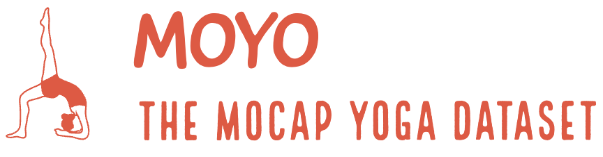
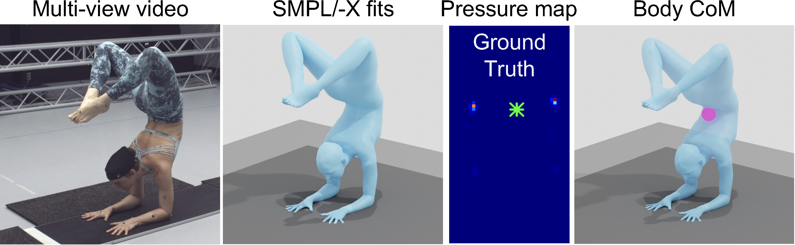
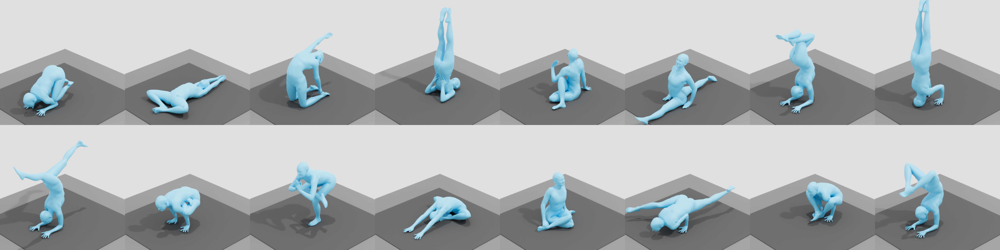

## MOYO 🧘🏻‍♀️: A dataset containing complex yoga poses, multi-view videos, SMPL-X meshes, pressure and body center of mass

<p align="center"> 
    
</p>

[ [Project Page](https://ipman.is.tue.mpg.de) ][ [MOYO Dataset](https://moyo.is.tue.mpg.de) ][ [Paper](https://openaccess.thecvf.com/content/CVPR2023/papers/Tripathi_3D_Human_Pose_Estimation_via_Intuitive_Physics_CVPR_2023_paper.pdf) ][ [Video](https://www.youtube.com/watch?v=eZTtLUMnGIg) ] [[Register MoYo Account]](https://moyo.is.tue.mpg.de/register.php)

<p align="center">    
    
</p>

This is a repository for download, preprocessing, visualizing, running evaluations on the MOYO dataset.

Our dataset provides a challenging new benchmark; it has extreme poses, strong self-occlusion, and
significant body-ground and self-contact. 

<p align="center">
    
</p>

### Getting started

Get a copy of the code:
```bash
git clone https://github.com/sha2nkt/moyo.git
```

General Requirements:

- Python 3.9

[//]: # (- torch 1.13.0)
[//]: # (- CUDA 11.6 &#40;check `nvcc --version`&#41;)
[//]: # (- pytorch3d 0.7.3)
Install the environment:

```bash
ENV_NAME=moyo_p39
conda create -n $ENV_NAME python=3.9
conda activate $ENV_NAME
pip install .
```

### Downloading the dataset

MOYO provides the following data:
- `arctic_data/data/images [649G]`: Full 2K-resolution images
- TODO
- TODO

⚠️ Register accounts on [MOYO](https://moyo.is.tue.mpg.de/register.php), and then use your username and password when prompted.

The following command downloads the full dataset to `./data/` minus the images and unzips them (-u flag).
```bash
bash ./moyo/bash/download_moyo.sh -o ./data/ -u
```

If you additionally want to download the images, you can run the following command:
```bash
bash ./moyo/bash/download_moyo.sh -o ./data/ -u -i
```

The following command downloads the full dataset to `./data/` (including images), unzips the downloaded zips and deletes the zip files to save space. This will take a while but will give you a fully usable dataset.
```bash 
bash ./moyo/bash/download_moyo.sh -o ./data/ -u -i -d
```

### Citation
If you found this code helpful, please consider citing our work:

```bibtex
@inproceedings{tripathi2023ipman,
    title = {{3D} Human Pose Estimation via Intuitive Physics},
    author = {Tripathi, Shashank and M{\"u}ller, Lea and Huang, Chun-Hao P. and Taheri Omid
    and Black, Michael J. and Tzionas, Dimitrios},
    booktitle = {Proceedings of the IEEE/CVF Conference on Computer Vision and Pattern
    Recognition (CVPR)},
    month = {June},
    year = {2023}
}
```

### License

See [LICENSE](LICENSE).

### Acknowledgments

Constructing the MOYO dataset is a huge effort. The authors deeply thank Tsvetelina Alexiadis, Taylor McConnell, Claudia Gallatz, Markus Höschle, Senya Polikovsky, Camilo Mendoza, Yasemin Fincan, Leyre Sanchez and Matvey Safroshkin for data collection, Giorgio Becherini for MoSh++, Joachim Tesch and Nikos Athanasiou for visualizations, Zincong Fang, Vasselis Choutas and all of Perceiving Systems for fruitful discussions. This work was funded by the International Max Planck Research School for Intelligent Systems (IMPRS-IS) and in part by the German Federal Ministry of Education and Research (BMBF), Tübingen AI Center, FKZ: 01IS18039B.".

### Contact

For technical questions, please create an issue. For other questions, please contact `ipman@tue.mpg.de`.

For commercial licensing, please contact `ps-licensing@tue.mpg.de`.